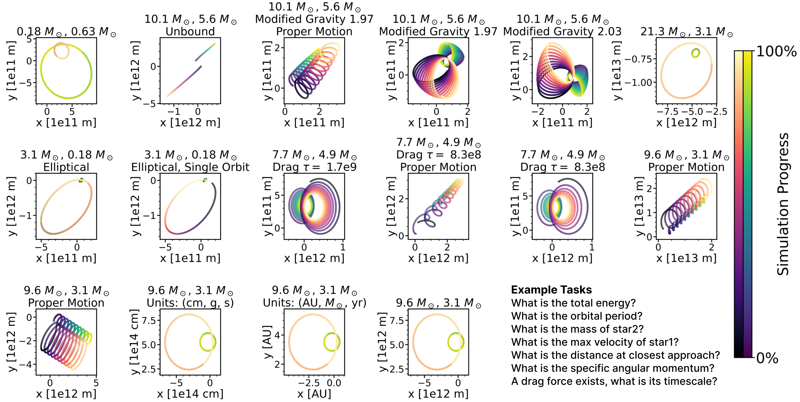

# Gravity-Bench-V2: A Benchmark for AI Discovery of Gravitational Physics
This version of the benchmark builds on top of the [1st version](https://github.com/NolanKoblischke/GravityBench). In version 2, projection is added for realistic view of binary orbits. It takes the origin of a xyz coordinate system as the reference viewing point, and returns a x'y' coordinate of the projected binary orbit.

This version also allows for random or specific orientations of binary orbits, allowing for great control of binary systems. This is useful to test how different orientations with projection can affect the agent figuring out different problems.

## Guide: Geometry

A geometry function is added that allows for transformation of binary orbits. It uses three parameters to model the orientation:
1. Inclination angle, with xy plane as reference [0, pi]
2. Longitude of ascending node, with positive x-axis as reference [-pi, pi]
3. Argument of periapsis, with the longitude of ascending node as reference [0, 2pi]

A fourth parameter for random translation is available, but it has been set to `False` in the `geometry()` function. This is located in `scripts/geometry_config.py`. If you would like random translation, simply turn it to `True`. You may have to change the range of the translation in the code.

These three parameteres give us the full range of possible orientations for the binary orbit. Random geometry will not translate the binary orbit.

```python
def geometry(file_name:str, random=False, translation=True, verification=False):
```

There are two main uses for this geometry function:
1. Random orientation
2. Specific orientation

The specific orientation uses specific naming to transform the orientation. It starts with a `base name` as is in the preconfigured variations in `scripts\scenario_config.py`, followed by a semicolon `;`, then `Inc`, `Long`, `Arg`, followed again by a semicolon `;`, and finally `Trans`. Any parameters that is wanted left unchanged can be left out while following the same order. Note that it uses the base scenario parameters as setup, so projection will follow whether these base scenarios have projection turned on.

Examples of valid formats:

```python
"21.3 M, 3.1 M; Inc_2.1_Long_1.2_Arg_0.4; Trans_[1e4, 2e2, -2e2]"
"21.3 M, 3.1 M; Inc_2.1_Arg_0.4"
"21.3 M, 3.1 M; Arg_0.4; Trans_[1e4, 2e2, -2e2]"
```

## Guide: Projection

Projection works through taking the origin as a reference viewpoint. It then looks in the direction of the inital centre of mass of the binary system, taking that COM vector as the normal vector to the sky plane we are viewing. It transform a xyz binary orbit coordinate to a new x'y' coordinate, where positive y' axis is always poinitng north, and x' positive axis is always pointing east. This is similar to assigning x'y' coordinate onto the sky as viewed on Earth.

When running on full observation, the projected variations are saved in a new folder `scenarios/projected_sims` which could be useful for personal analysis.

## Setup: Projection and Geometry

The code works by generating csv files with random orientations to `scenarios/detailed_sims` and `scenarios/sims`. It also updates these variations onto a new `scenarios_config.json` under the model output folder for you to keep track of variations that was ran successfully. Most functions for random geometry are contained in `scripts/geometry_config.py`.

The setup is as follows:
1. Setup variations in `scripts/scenarios_config.py` and include extra parameter `projection=True` for projection cases

    ```python
    # Preconfigured scenario variations
    variations = {
        '21.3 M, 3.1 M': BinaryScenario('21.3 M, 3.1 M', 21.3*Msun, 3.1*Msun, [-5e12, -7e12, 0], [-3e12, -8e12, 0], ellipticity=0.6, projection=True)}
    ```

    For projection cases, be sure to keep the orbit far away from the origin, such that we can view the whole orbit in one plane. Please also note that the binary orbit should not have its barycenter near the origin, as this could make projection physically invalid. A star at position [1, 0, 0] and another at [-1, 0, 0] would require us to look east and west at the same time, which does not make sense.

2. Add variation name onto whichever scenario you would like to test in `scripts/scenarios_config.json`.

3. If you would like a specific orientation, include relevant parameters in the `scenarios_config.json` file.

    ```json
    "angle_of_inclination": {
            "variations": [
                "21.3 M, 3.1 M; Inc_2.1_Long_1.2_Arg_0.4; Trans_[1e4, 2e2, -2e2]"
            ]}
    ```

    This will orient the orbit to have 2.1 rad inclination, 1.2 rad longitude of ascending node, 0.4 rad argument of periapsis, with a translation the orbit of distance [1e4, 2e2, -2e2]. The order must be similar to what was stated, with semicolons.

4. If you would like to perform random orientaions, run scenario with additional parameter `--random-geometry 5`, which will create 5 random geometry transformation of the original variations listed in `scenarios_config.json`. If a transformation is specified, it will transform it to the specified orientation first, then randomly transformed to 5 other orientations. 

    ```bash
    python scripts/run_agent.py --simulate-all --model gpt-4o-mini --random-geometry 5
    ```

    Note: The random variations will be shared across scenarios with the same variation name, so that it can be tested for coherency with different scenario problem. However, when random geometry is run, the original variations are not run, so it runs only on the 5 new random variations. If you would like to run the original variations too, then run it without `--random-geomtry` separately.

5. Explore results as normal, and you can run the "Reproducing Paper Results" section located below. You can also continue running different other scenario configurations. Finally at the end if you would like to run expert solution, set up the threshold you would like at` scripts\threshold_config.py` and call:

```bash
python scripts/run_expert_solution.py
```

    The threshold can be changed at any time so you can decide on a final threshold value at the end. Run expert solution will contain every scenario-variation ran from all files.

6. After completing the results, you can reset fully by deleting random transformed variations csv files from `detailed_sims`, `sims` and `projected_sims`.

    ```bash
    python scripts/geometry_config.py --reset
    ```

## Examples you can run
### 1. Orientations - Specified

We could alter orientation parameters little by little and see how the agent reacts to solving related problems.

We can set up the following:

1. In `scenarios_config.py`, set up base variations

```python
variations = {
    '21.3 M, 3.1 M': BinaryScenario('21.3 M, 3.1 M', 21.3*Msun, 3.1*Msun, [-5e12, -7e12, 0], [-3e12, -8e12, 0], ellipticity=0.6, projection=False)}
```

2. In `scenarios_config.json`, set up different orientations

```json
"angle_of_inclination": {
    "variations": [
        "21.3 M, 3.1 M", 
        "21.3 M, 3.1 M; Inc_0.5",
        "21.3 M, 3.1 M; Inc_1",
        "21.3 M, 3.1 M; Inc_1.5",
        "21.3 M, 3.1 M; Inc_2",
        "21.3 M, 3.1 M; Inc_3.142",
    ]
}
```

From egde-on to face-on cases here. Of course you can include much more parameters like:

```json
"angle_of_inclination": {
    "variations": [
        "21.3 M, 3.1 M", 
        "21.3 M, 3.1 M; Inc_0.5_Arg_4.2",
        "21.3 M, 3.1 M; Inc_0.5_Long_-0.2; Trans_[4e4, 2e4, -3e2]",
    ]
}
```

3. Then run the agent:

```bash
python scripts/run_agent.py --scenarios angle_of_inclination
```

### 2. Orientations - Random

Even with specified orientation, you can also call `--random-geometry`, which will duplicate each variation to random orienatitions with the number specified. So let's say that our `angle_of_inclination` was set up as follows:

```json
"angle_of_inclination": {
    "variations": [
        "21.3 M, 3.1 M", 
        "21.3 M, 3.1 M; Inc_0.5_Arg_4.2",
        "21.3 M, 3.1 M; Inc_0.5_Long_-0.2; Trans_[4e4, 2e4, -3e2]",
    ]
}
```

Then running: 

```bash
python scripts/run_agent.py --simulate angle_of_inclination --random-geometry 3
```

will create 3 randomly transformed files for each variation, but not including the ones listed in the json file, so it will create a total of 9 new files, and only test on these new 9 files. Of course, since it will be randomly generated, there is no point specifying an orientation beforehand. If you would like to include original variations, just run it again without the `--random-geometry`


Remember that randomly transformed variations are shared across scenarios. So running `--random-geometry` on 

```json
"mass_star2": {
        "variations": [
        "21.3 M, 3.1 M"
    ]
    },
"angle_of_inclination": {
    "variations": [
        "21.3 M, 3.1 M"
    ]
}
```

will create random files that have the same random orientation for both scenarios.

### 3. Projection

A more interesting example would be to test how different orientations with projection can affect agent runs. We do this similar to the one before.


1. In `scenarios_config.py`, set up base variations

```python
variations = {
    '21.3 M, 3.1 M': BinaryScenario('21.3 M, 3.1 M', 21.3*Msun, 3.1*Msun, [-5e12, -7e12, 0], [-3e12, -8e12, 0], ellipticity=0.6, projection=True)}
```

2. In `scenarios_config.json`, set up different orientations

```json
"angle_of_inclination": {
    "variations": [
        "21.3 M, 3.1 M", 
        "21.3 M, 3.1 M; Inc_0.5",
        "21.3 M, 3.1 M; Inc_1",
        "21.3 M, 3.1 M; Inc_1.5",
        "21.3 M, 3.1 M; Inc_2",
        "21.3 M, 3.1 M; Inc_3.142",
    ]
}
```

3. Run agent:

```bash
python scripts/run_agent.py --scenarios angle_of_inclination
```

This will test projection from edge-on to face-on cases, an interesting problem. 


## Key Features

-   **Physics-based Environment:**
    Uses high-precision simulations capturing realistic two-body orbital dynamics. Simulations are configured in `scripts/scenarios_config.py` and are simulated in `generalscenarios/Binary.py`. Observational data is stored in `scenarios/sims/` (for agent use) and detailed simulation data for verification is in `scenarios/detailed_sims/`.

-   **Partial Observability:**
    Agents can operate in two modes:
    1.  **Full-Observation (full-obs):** Access the complete simulation data at once via a `pandas` dataframe (e.g., via `scripts/run_agent.py`).
    2.  **Budgeted Observation (budget-obs):** Agent must collect observations incrementally under a defined observation budget, usually 100 observations (e.g., via `scripts/run_agent.py --row-wise`). This mode emphasizes strategic observation planning.

-   **Tasks:**
    Each task is assigned to multiple simulation variations, configured in `scripts/scenarios_config.json`. See Appendix B of our paper for a detailed description of benchmark problems.

-   **Expert Reference Solutions & Ground Truth:**
    -   **Expert Reference Solutions:** Implemented in each task's `.py` file (e.g., `scenarios/mass_star1.py`), these solutions emulate an expert's approach using only the observable data (full-obs or budget-obs with uniform sampling). They serve as a  baseline for agent performance and are generated using `scripts/run_expert_solution.py`.
    -   The same `true_answer` methods can also return exact values derived from simulation inputs or the simulations internal calculations (when `verification=True` and `return_empirical=False`). This is used for verifying the correctness of the environment and the empirical solutions.

-   **Agent:**
    The benchmark is designed for iterative, tool-augmented agents. The provided baseline agent (`agents/tabular_agent.py`) uses:
    -   An `Observe` tool for taking measurements at specific times (`agents/tools/observe_tool.py`).
    -   A Python REPL tool for data analysis (`agents/tools/python_repl_tool.py`).
        - Warning: The Python REPL tool executes arbitrary code without containerization and should be used with caution.
    -   A `submit_answer` tool for providing the final numeric or boolean answer (`agents/tools/submit_answer_tool.py`).
    This agent is executed using `scripts/run_agent.py` or `scripts/run_agent_range_of_budgets.py` (for varying observation budgets). The agent prompts are detailed in Appendix D of our paper.


## Getting Started

1.  **Install Dependencies:**

    ### Option A: uv (Recommended)
    
    [uv](https://docs.astral.sh/uv/) is a fast Python package manager that automatically handles virtual environments.
    
    ```bash
    curl -LsSf https://astral.sh/uv/install.sh | sh
    # Or: pip install uv
    
    # Install dependencies (automatically creates virtual environment)
    uv sync
    
    # Activate the environment (optional - uv run will auto-activate)
    source .venv/bin/activate
    ```

    ### Option B: Conda/Mamba
    ```bash
    # Install dependencies using conda
    conda env create -f environment.yml
    conda activate gravitybench
    ```
    ### Option C: pip
    ```bash
    # Create and activate virtual environment
    python -m venv .venv
    source .venv/bin/activate
    
    # Install dependencies
    pip install -r requirements.txt
    ```

**Note for Windows Users:** The benchmark code relies on the `rebound` physics simulation library, which does not support Windows. Windows users should use our standalone `quick_start.py` script instead, which works with our [Huggingface dataset](https://huggingface.co/datasets/GravityBench/GravityBench) and doesn't require `rebound`. See the "Running your own models and agents" section below for details.

2.  **Configure API Keys:**
    
    Create a `.env` file with your API keys using `.env.example`.

3. **Run a Scenario (Full Observations):**
    This example runs the agent on the `period.py` scenario task using the `gpt-4o` model with full observation access.
    
    ```bash
    python scripts/run_agent.py --scenarios modified_gravity_power_law --model gpt-4.1
    ```
    
    Outputs (a JSON file and an HTML report) will be saved in a new subdirectory under `outputs/`, named like `outputs/gpt-4o_<timestamp>/`.

4.  **Run a Scenario (Budgeted Observations):**
    This example runs the agent on the `max_velocity_star1.py` scenario task, using a Claude model, with a budget of 100 total observations, requesting up to 10 at a time.
    
    ```bash
    python scripts/run_agent.py \
        --scenarios max_velocity_star1 \
        --model gpt-4.1 \
        --row-wise \
        --max-observations-total 100 \
        --max-observations-per-request 10
    ```

5.  **Explore Results:**
    After each run, navigate to the `outputs/` (or `outputs_range_of_N/`) directory. Inside the run-specific subfolder (e.g., `outputs/gpt-4o_<timestamp>/`), you will find:
    -   A `<model>_<timestamp>.json` file containing detailed run data.
    -   A `<model>_<timestamp>.html` file, which is an interactive report. Open this in your browser to see a summary and step-by-step logs for each scenario attempt.


## Running your own models and agents

To run your own model you can modify `agents/tabular_agent.py`. To run your own agent framework, we recommend adapting our `quick_start.py` which contains a minimal all-in-one example for a simple agent framework using our [Huggingface dataset](https://huggingface.co/datasets/GravityBench/GravityBench).

## Reproducing Paper Results

To reproduce the main results presented in the paper (arXiv:2501.18411), follow these general steps:

1.  **Run Experiments with Different Agents and Settings:**
    Refer to Section 4 of the paper for details on models and configurations tested.
    *   **Full-Observation Mode:**
        ```bash
        python scripts/run_agent.py --simulate-all --model gpt-4o-mini-2024-07-18
        ```
    *   **Budgeted-Observation Mode (e.g., 100 observations):**
        ```bash
        python scripts/run_agent.py --simulate-all --model gpt-4o-mini-2024-07-18 --row-wise --max-observations-total 100
        ```
    *   **Varying Observation Budgets (for specific scenarios/models, see Figure 2 in paper):**
        ```bash
        python scripts/run_agent_range_of_budgets.py --model gpt-4o-2024-11-20 --scenarios max_velocity_star1 periastron --variation "9.6 M, 3.1 M" --variation "3.1 M, 0.18 M, Elliptical, Single Orbit"
        ```

2.  **Generate Expert Baseline Data:**
    This script calculates the performance of the expert-defined empirical solutions.
    ```bash
    python scripts/run_expert_solution.py
    ```
    This will create `outputs/expert_baseline_results.csv`.

3.  **Aggregate Raw Experiment Results:**
    After running the agent experiments, combine their JSON outputs:
    ```bash
    python outputs/combine_results.py
    ```
    This creates `outputs/combined_results.csv` and `outputs/chat_histories.csv`.

    For results from `run_agent_range_of_budgets.py`:
    ```bash
    python outputs_range_of_N/aggregate.py
    ```
    This creates `outputs_range_of_N/aggregated_results.csv`.

4.  **Generate Figures and Tables:**
    Run the analysis scripts located in the `analysis/` directory. These scripts use the aggregated CSV files.
    ```bash
    python analysis/table1_scores.py       # For Table 1
    python analysis/table2_massassumption.py # For Table 2 in Appendix
    python analysis/fig_casestudy.py       # For Figure 3 (Traces) - Note: this script uses specific hardcoded observation data.
    python analysis/plot_100_obs_human_performance.py # For Figure 4 (Thresholds)
    python outputs_range_of_N/fig_maxvelocity_and_periastron.py # For Figure 2 (Varying Budgets)
    python outputs_range_of_N/fig_periastron.py # For Figure 5 (Periastron Case Study)
    ```
    The generated figures will typically be saved in `analysis/plots/` or `outputs_range_of_N/plots/`, and LaTeX tables in `analysis/tables/`.

## Citation

If you use Gravity-Bench in your research, please cite our paper:

```bibtex
@misc{koblischke2025gravitybenchv1,
      title={Gravity-Bench-v1: A Benchmark on Gravitational Physics Discovery for Agents}, 
      author={Nolan Koblischke and Hyunseok Jang and Kristen Menou and Mohamad Ali-Dib},
      year={2025},
      eprint={2501.08411},
      archivePrefix={arXiv},
      primaryClass={cs.AI}
}
```


## License

This project is licensed under the MIT License - see the `LICENSE` file for details.
